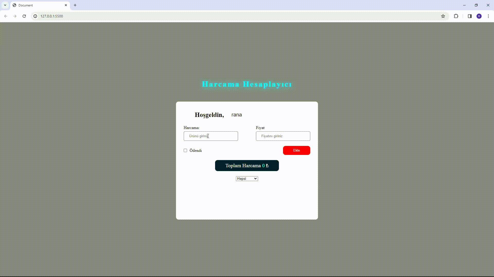

<h1>Spending -Tracking -Project</h1>

Özellikler

-Kullanıcı, adını giriş kutusuna yazabilir ve değişiklikleri kaydedebilir.

-Kullanıcı adı, yerel depolama kullanılarak kaydedilir ve sayfa yenilendikten sonra bile hatırlanır.

-Kullanıcılar, harcama adı, tutarı ve ödeme durumu girişi yapabilir.

-"Ekle" butonuna tıklandığında, girilen harcama listeye eklenir ve toplam tutar güncellenir.

-Eklenen her harcama, üzerindeki "Sil" butonuna tıklanarak listeden kaldırılabilir.

-Silinen harcamanın tutarı toplam tutardan çıkarılır.

-Harcama eklenirken veya silinirken, toplam tutar otomatik olarak güncellenir ve sayfa üzerinde gösterilir.

-Kullanıcılar, "Ödendi" veya "Ödenmedi" filtrelerini kullanarak harcamaları görüntüleyebilir.

-Tüm harcamalar, "Tümü" seçeneği ile görüntülenebilir.

